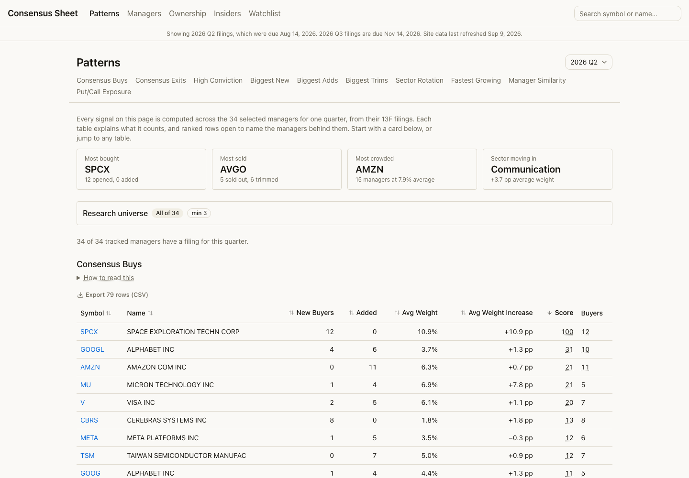
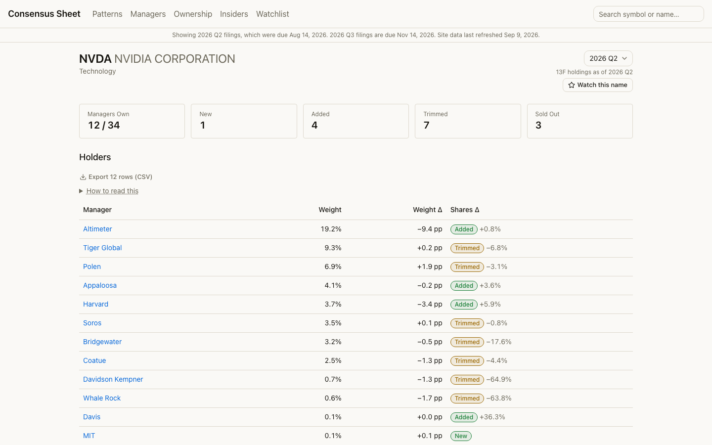

# Consensus Sheet

**[13f.darren-zhu.com](https://13f.darren-zhu.com)** — what 33 well-known investment managers own, and what they changed last quarter, from their SEC filings.

[](https://13f.darren-zhu.com/patterns)

Questions it answers:

- **Which stocks did several managers buy in the same quarter?** The [Patterns](https://13f.darren-zhu.com/patterns) page ranks them, and every row names the managers behind it.
- **Who owns NVIDIA, and did they add or trim?** Any [stock page](https://13f.darren-zhu.com/stock/NVDA) lists its holders with each one's weight and share change.
- **Has an activist just taken a stake in a company?** The [Ownership](https://13f.darren-zhu.com/ownership) page tracks Schedule 13D and 13G filings as they land.

[](https://13f.darren-zhu.com/stock/NVDA)

Everything is derived from public filings and recomputed from scratch on every run. How each number is defined, and what it does not cover, is in **[docs/METHODOLOGY.md](docs/METHODOLOGY.md)** — read that before trusting a figure.

This is not investment advice.

## Finding your way around

Four things the site is built to do:

1. **Find a crowded stock.** [Patterns](https://13f.darren-zhu.com/patterns) → Consensus Buys. Open a row's *Buyers* to see which managers, and its *Score* to see the arithmetic behind the ranking.
2. **Inspect who holds it.** Click the symbol. The stock page lists every tracked holder, its weight, and whether it added or trimmed.
3. **Compare what changed.** A manager's page shows its whole reported book, quarter over quarter, with sector exposure and its most similar managers.
4. **Verify a filing.** Every manager-quarter links its source filings on EDGAR by accession, so any number here can be traced back to the document it came from.

## What this is

This site shows what big investors own. The data comes from SEC Form 13F filings. It also finds patterns across managers, like which stocks many of them are buying at the same time.

## Coverage and limits

- **33 managers**, listed below, chosen by hand for being well known and running concentrated books. Adding or removing one changes every count and average on the site. "Consensus" always means consensus among this list, not the market.
- **12 quarters** of history. Older filings reported values in thousands rather than dollars, which would need separate handling.
- **13F holdings** update monthly, on the 16th; a quarter's filings are not due until 45 days after it ends. **13D/13G ownership** updates daily, from 2024-12-18 onward, when the SEC's structured format became mandatory.
- **Long US-listed equity positions only.** No shorts, cash, bonds, foreign listings, or private holdings. For an endowment, most of the real portfolio is invisible here.
- A missing filing is shown as missing, never as a manager holding nothing.

Full definitions and the current open limitations: **[docs/METHODOLOGY.md](docs/METHODOLOGY.md)**.

## What 13F data is (and is not)

A 13F is a report. Large US investment managers must file it with the SEC every quarter.

- It shows long positions in US stocks. A long position means the manager owns the stock.
- It does not show short positions. A short position is a bet that a stock will fall.
- It does not show cash, bonds, or most foreign stocks.
- It can be filed up to 45 days after the quarter ends. So the data is always a little old.
- It includes options. A put option is not the same as a short, and can be a hedge. The site labels them "Reported Put Exposure" and keeps them out of every weight, because an option row reports the value of the underlying shares, not what was paid.
- Values are in US dollars.
- This site is not investment advice.

## Managers tracked

| Manager | Person | Style label |
|---|---|---|
| Berkshire Hathaway | Warren Buffett | Value / Quality |
| Pershing Square | Bill Ackman | Activist / Quality |
| TCI Fund Management | Chris Hohn | Quality / Compounders |
| Baupost Group | Seth Klarman | Value / Event Driven |
| Appaloosa | David Tepper | Macro / Value |
| Duquesne Family Office | Stanley Druckenmiller | Macro |
| Coatue Management | Philippe Laffont | Tech / Growth |
| Tiger Global | Chase Coleman | Tech / Growth |
| Viking Global | Andreas Halvorsen | Tech / Growth |
| Lone Pine Capital | Steve Mandel | Tech / Growth |
| Third Point | Dan Loeb | Event Driven / Activist |
| Markel | Tom Gayner | Value / Quality |
| Fairfax Financial | Prem Watsa | Value / Quality |
| Ruane, Cunniff & Goldfarb (Sequoia Fund) | — | Value / Quality |
| Davis Selected Advisers | Christopher Davis | Value / Quality |
| Elliott Investment Management | Paul Singer | Activist |
| Carl Icahn | Carl Icahn | Activist |
| Starboard Value | Jeffrey Smith | Activist |
| Trian Fund Management | Nelson Peltz | Activist |
| ValueAct | Mason Morfit | Activist |
| JANA Partners | Barry Rosenstein | Activist |
| Bridgewater Associates | Ray Dalio | Macro |
| Soros Fund Management | George Soros | Macro |
| Altimeter Capital | Brad Gerstner | Tech / Growth |
| Whale Rock Capital | Alex Sacerdote | Tech / Growth |
| D1 Capital Partners | Dan Sundheim | Tech / Growth |
| Paulson & Co | John Paulson | Event Driven |
| Farallon Capital | — | Event Driven |
| Davidson Kempner | — | Event Driven |
| Akre Capital Management | Chuck Akre | Quality / Compounders |
| Polen Capital | Dan Davidowitz | Quality / Compounders |
| Harvard Management Co | — | Endowment |
| MIT | — | Endowment |

13F filings from endowments only cover their sliver of US public equities. Most of an endowment's assets sit in private equity, hedge funds, and other holdings a 13F never reports, so these rows are a much smaller slice of the real portfolio than a fund like Berkshire's.

Yale was tracked until September 2026 and has been dropped. A manager only has to file a 13F if it holds more than $100 million of US-listed stock. Yale's directly held stock is worth about $2 million, so it stopped filing after the third quarter of 2025 and there is nothing left to show.

The style labels are set by hand. You can change them in `ingest/funds.json`.

## Ownership filings (13D and 13G)

The site also tracks two other SEC filings: Schedule 13D and Schedule 13G.

Either one is filed by an investor who owns more than 5% of a class of a company's shares.

Which form you file depends on whether you are eligible for the shorter one.

A 13G is the short form. Three kinds of investor may use it. Large institutions buying in the ordinary course of business. Passive investors who hold under 20% and do not seek control. And investors exempt from the rules for other reasons. All three must lack any intent to change or influence control of the company.

A 13D is the long form. It is what you file when you are not eligible for a 13G. That includes investors who do intend to influence the company. It also includes investors who simply hold too much, or who lost their 13G eligibility for a technical reason.

So a 13D is worth reading, but it is not proof of an activist campaign. And a 13G filer is not always a quiet small holder. The largest index funds file 13Gs on hundreds of companies.

The deadlines differ too. An initial 13D is due within 5 business days of crossing the threshold. A 13D amendment is due within 2 business days of a material change. A 13G deadline depends on the filer's category and on what triggered the filing. A passive investor's first 13G is due in 5 business days. A large institution's is due 45 days after the end of the quarter. A 13F, by contrast, can take up to 45 days after the quarter ends.

The SEC's own summary of these rules is in its [beneficial ownership fact sheet](https://www.sec.gov/files/33-11253-fact-sheet.pdf).

Ownership events start on December 18, 2024. Older filings are not structured data, so we skip them.

Each new filing becomes one of these events:

- **New.** A first filing on a stake above 5%.
- **Increased.** The stake grew by a meaningful amount.
- **Decreased.** The stake shrank by a meaningful amount.
- **Below 5%.** The stake fell under the 5% reporting threshold. This is not the same as selling out. The investor may still hold 4.9%, which no longer has to be reported here.
- **Switched.** The investor moved from a 13G to a 13D, or the other way.
- **Updated.** Something else changed, like the filing's stated purpose.

Each event also shows how many tracked managers already held the stock. That number comes from the last 13F quarter, so it is always older than the filing next to it. Zero means none of them held it. A dash means the 13F side has not run yet.

## The signals

The site computes these signals once per quarter.

1. **Manager Conviction.** How big each stock is inside a manager's reported equity holdings, and how that changed since last quarter. Option, note and warrant rows are excluded from every weight.
2. **Stock Consensus.** How many managers own a stock, and how much of their portfolio it is.
3. **Consensus Buys.** Stocks that three or more managers bought or added in the same quarter.
4. **Consensus Exits.** Stocks that three or more managers sold or trimmed in the same quarter.
5. **High-Conviction Overlap.** Stocks that three or more managers each hold at 3% or more of their reported equity holdings.
6. **Conviction Score.** A score from 0 to 100. It rewards stocks that a few managers hold in big size and just bought. It is relative within one quarter — 100 is that quarter's top score, not a rating — so scores are not comparable across quarters.
7. **Sector Exposure.** How much of each manager's portfolio is in each sector, and how that changed.
8. **Sector Rotation.** Which sectors managers are moving into or out of, as a group.
9. **Manager Similarity.** How alike two managers' portfolios are, from 0 to 1.
10. **Manager Clusters.** Managers grouped by style, like "Tech / Growth".
11. **Ownership Change.** How the number of managers holding a stock changed over time.
12. **Position-Weight Trend.** How the average portfolio weight of a stock changed over time.
13. **Put / Call Exposure.** Which managers report puts or calls on a stock. This is kept separate from stock holdings.

## How it works

```
GitHub Actions (once a month, or by hand)
  └─ ingest/ingest.py (Python)
       ├─ fetch   : SEC EDGAR → last 12 quarters of 13F filings per manager
       ├─ enrich  : CUSIP → ticker (OpenFIGI) → sector (SEC industry code)
       ├─ derive  : all 13 signals
       └─ store   : Google Cloud Storage (files) + Firestore (documents the site reads)

GitHub Actions (once a day, or by hand)
  └─ ingest/ownership.py (Python)
       ├─ fetch   : SEC EDGAR → new Schedule 13D/13G filings
       ├─ derive  : new / increased / decreased / exited / switched / updated events
       └─ store   : Google Cloud Storage (archive) + Firestore (documents the site reads)

GitHub Actions (on every push to main)
  └─ build the site → Firebase Hosting → your domain
```

A script runs once a month. It downloads the latest filings and computes every signal. It writes the results to Firestore. The website only reads and displays them. Nothing is computed live.

Each page reads a small number of whole documents — never a query, never an aggregation. `meta/latest` on every page, plus one document for the page's own data: two reads for Patterns and Ownership, three for a stock, four for a manager (the manager, its quarter, and its 13D/13G filings). The search box loads its symbol list once, the first time you focus it.

A second script runs once a day. It checks for new 13D and 13G filings and turns each one into an event. You can see them on the Ownership page. They also show up on a stock's own page. Every investor gets their own page too — a tracked manager's page, or `/investor/:cik` for everyone else.

Each ingest run also saves a small file, `data/last_ingest.json`, into the repo. It shows when the data was last updated. It also keeps the schedule alive. GitHub turns off schedules in repos with no activity for 60 days.

For diagrams of the full system and the data pipeline, see [`docs/ARCHITECTURE.md`](docs/ARCHITECTURE.md).

## Set up your own copy

You need a Google account and a GitHub account. Some values are **secret**. Never put a secret in the code.

1. Go to the Firebase console. Create a project. Turn on **Firestore** (Native mode) and **Hosting**.
2. In Project settings, add a **Web app**. Copy the `API key`, `project ID`, and `app ID`. These three values are **public**. Put them in `web/.env` and in your GitHub repository **Variables**.
3. Upgrade the project to the **Blaze** plan. This turns on billing. Normal use stays inside the free tier. Set a budget alert at $5 to be safe. Create a Cloud Storage bucket. Put its name in the `GCS_BUCKET` variable.
4. In Google Cloud IAM, create a service account. Give it the **Firebase Admin** and **Storage Object Admin** roles. Create a JSON key. This key is **secret**. Paste the whole file into a GitHub secret named `FIREBASE_SERVICE_ACCOUNT`. Keep a copy outside the repo for local runs.
5. Get a free API key from openfigi.com. This is **secret**. Save it as the GitHub secret `OPENFIGI_API_KEY`.
6. The SEC asks for your name and email on every request. Save `Your Name your@email.com` as the GitHub secret `EDGAR_IDENTITY`. This is **secret** because it is your email.
7. Create a public GitHub repository. Push the code. Add the secrets and variables under Settings → Secrets and variables → Actions.
8. In the Firebase console, open Hosting. Add your custom domain. Add the DNS records it shows you at your domain registrar.
9. Run `npx firebase-tools login` once. Then run `npx firebase-tools deploy --only firestore:rules`. This makes the data readable by the site.

## Run locally

Requires **Python 3.12** (3.10 works; avoid 3.11-only syntax) and **Node 22 or newer**. Every command below says which directory to run it in.

### 1. Preview the site against live data

Only needs the three public `VITE_FIREBASE_*` values, so this is the quickest way to see the app.

```bash
cd web
npm install
cp .env.example .env        # PowerShell: Copy-Item .env.example .env
# fill in .env, then:
npm run dev
```

### 2. Run the 13F ingest

Needs `EDGAR_IDENTITY`, `OPENFIGI_API_KEY`, and a service-account key **outside** the repo, pointed at by `GOOGLE_APPLICATION_CREDENTIALS`.

```bash
cd ingest
python -m venv .venv
source .venv/bin/activate   # PowerShell: .\.venv\Scripts\Activate.ps1
pip install -r requirements.txt
cp .env.example .env        # PowerShell: Copy-Item .env.example .env
# fill in .env, then:
python ingest.py --dry-run
```

`--dry-run` downloads and computes everything, prints a summary, and writes nothing: no Firestore documents, no `securities/` cache entries, no GCS files. Drop the flag to write for real. A real run rewrites every quarter in the window, so it is safe to repeat.

Useful flags: `--fund CIK` for one manager, `--quarters N` to shorten the window, `--refresh all` to rebuild the ticker and sector cache after changing a rule.

### 3. Backfill 13D/13G ownership

`GCS_BUCKET` is required here — this pipeline keeps its state in the bucket and has no local fallback. The first run has no state to resume from, so give it a start date.

```bash
cd ingest
python ownership.py --dry-run --since 2024-12-18
```

Drop `--dry-run` to write. Backfill a long window in slices (a quarter at a time) rather than in one run, and use `--rebuild` only when you need every issuer and investor document rewritten.

### 4. Validate before pushing

```bash
cd ingest && pytest && ruff format . && ruff check .
cd web && npm run test && npm run build && npm run lint
```

### 5. Deploy

Pushing to `main` builds the site and deploys it to Firebase Hosting. Firestore rules are separate and deploy from the repo root:

```bash
npx firebase-tools deploy --only firestore:rules
```

There is no sample-data preview: the app reads Firestore directly, so seeing it with data means pointing it at a project that has some. Step 1 against the live project is the closest thing.

## Add a manager

1. Find the manager's CIK number on the SEC EDGAR site. The CIK is the SEC's ID for a filer.
2. Add a line to `ingest/funds.json` with the CIK, name, short name, and style label.
3. Run the ingest workflow from the GitHub Actions tab.

## Tuning the signals

Edit `ingest/signals_config.json`. Then run the ingest workflow.

- `quarters` — how many quarters to load. Default 12 (three years). Do not go past 12: filings for quarters before 2023 report dollar values in thousands, so they would read 1000 times too small.
- `consensus_min_managers` — how many managers make a "consensus". Default 3. With 33 managers tracked, 2 matched most of the market and the tables stopped meaning anything.
- `high_conviction_min_weight` — the share of reported equity holdings that counts as high conviction. Default 0.03 (3%).
- `high_conviction_min_managers` — how many managers make a high-conviction overlap. Default 3.
- `sector_move_threshold` — the sector weight change that counts as a move. Default 0.005 (0.5 points).
- `top_n` — how many rows each ranked table keeps. Default 25.
- `score` — the constants inside the Conviction Score formula. See `docs/PLAN.md` for the formula.

## Sector data

13F filings do not include a sector. We look up each stock's SEC industry code (SIC). Then we map that code to a sector with a table in `ingest/sectors.py`.

SIC is a filing code, not a finance one, so the two do not line up perfectly. We measure how far off we are: `python ingest/reconcile_sectors.py` scores the table against GICS, using the S&P 500 as the answer key. It currently agrees on **84.7%** of 496 names. Run it after changing the table.

ETFs and index funds are the exception. They are labelled "ETF / Fund" from OpenFIGI, not from the SIC. A fund's own industry code says "investment offices", which would put an S&P 500 fund in the Financials sector.

Sector lookups are cached per stock and never redone on their own. If you change how sectors are decided, run `python ingest.py --refresh all` once to rebuild the cache. `--refresh unknown` is the cheaper version: it only redoes the stocks whose sector came out "Unknown".

## Where the docs live

| Document | For |
|---|---|
| This README | using the site, and running your own copy |
| [docs/METHODOLOGY.md](docs/METHODOLOGY.md) | what every number means, and what it does not cover |
| [docs/ARCHITECTURE.md](docs/ARCHITECTURE.md) | diagrams of the system and the data pipeline |
| [docs/PLAN.md](docs/PLAN.md) | implementation history and outstanding work |

## License

MIT. See `LICENSE`.
