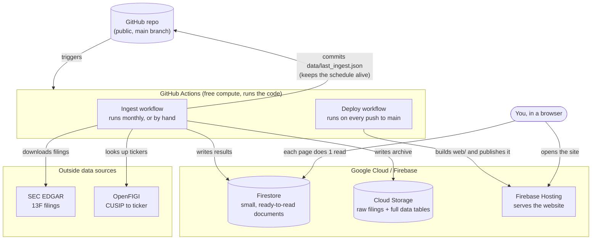
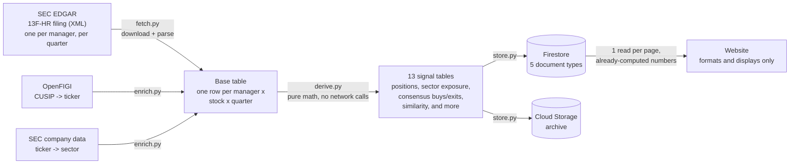

# Architecture

Two diagrams. The first shows which service does what. The second shows how
one piece of data — a stock a fund manager bought — travels from the SEC to
your screen.

## 1. System design

Who talks to whom, and where each piece runs.

**In plain words:**

- **GitHub Actions** is the only compute. Nothing runs on a server around the
  clock. Two jobs live there: one fetches and processes data, the other
  builds and publishes the website.
- The **ingest job** runs once a month (or whenever someone triggers it by
  hand). It talks to SEC EDGAR and OpenFIGI, then writes its results to
  Firestore and Cloud Storage.
- The **deploy job** runs every time code is pushed to `main`. It builds the
  website and publishes it to Firebase Hosting.
- **Firestore** holds small, pre-computed documents — one per page, roughly.
  The browser never asks Firestore to calculate anything; the numbers are
  already there.
- **Cloud Storage** is the archive: the raw filings as downloaded, plus every
  derived table as a file, in case anyone wants to reprocess the data later
  (with BigQuery, for example).
- The **browser never talks to GitHub Actions or Cloud Storage** — only to
  Firebase Hosting (for the app) and Firestore (for data).

## 2. Data flow / pipeline

What happens to one row of data, from a filing on SEC's website to a number
on your screen.

**In plain words, stage by stage:**

1. **Fetch** (`ingest/fetch.py`) — Every quarter, each of the 11 tracked
   managers files a 13F with the SEC. It lists every stock and option they
   hold, identified by a CUSIP code (not a ticker). `fetch.py` downloads the
   last 4 filings per manager and turns each one into plain rows: manager,
   quarter, CUSIP, dollar value, share count, and whether it's a put, a
   call, or a normal holding.
2. **Enrich** (`ingest/enrich.py`) — A CUSIP alone isn't useful to a reader.
   This step looks up the ticker symbol (via OpenFIGI, with a fallback
   already built into the SEC data) and the industry sector (via the SEC's
   own company database), then caches those lookups in Firestore so they're
   never looked up twice.
3. **Derive** (`ingest/derive.py`) — This is where every signal on the site
   gets computed: how much a manager's position changed quarter over
   quarter, which stocks multiple managers bought at once, how similar two
   managers' portfolios are, and so on. These are plain functions — data in,
   data out — with no network calls, so they're fully covered by tests.
4. **Store** (`ingest/store.py`) — The results are shaped into exactly what
   each web page needs (one Firestore document per page, roughly) and
   written in batches. A full copy of every table also goes to Cloud Storage
   as an archive.
5. **Display** (`web/src/*`) — The website reads one Firestore document per
   page and renders it. Clicking a column header re-orders the rows already
   on screen — it never asks Firestore for new numbers, and it never
   calculates a signal itself. If a number looks wrong, the fix is always in
   `derive.py`, never in the browser code.

## Why it's built this way

13F data changes four times a year, and only shortly after each quarter
closes. There's no reason to keep a server running, and no reason to compute
anything while a visitor is looking at the page — so the expensive work
(downloading, cleaning, and computing) happens once, on a schedule, and the
website just reads the answer.
